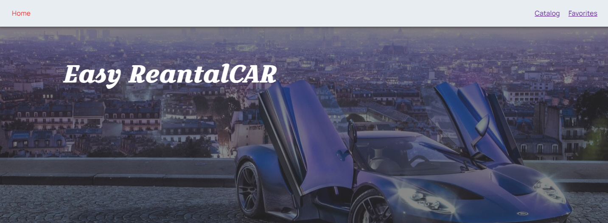
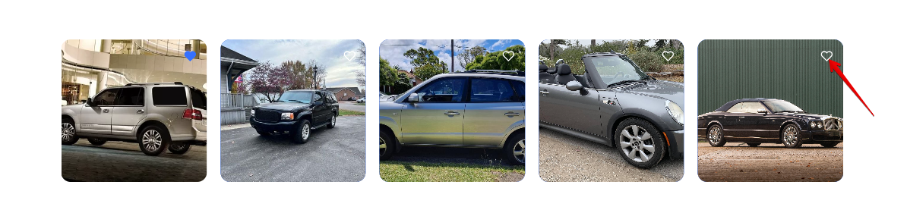
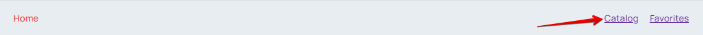
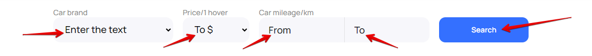
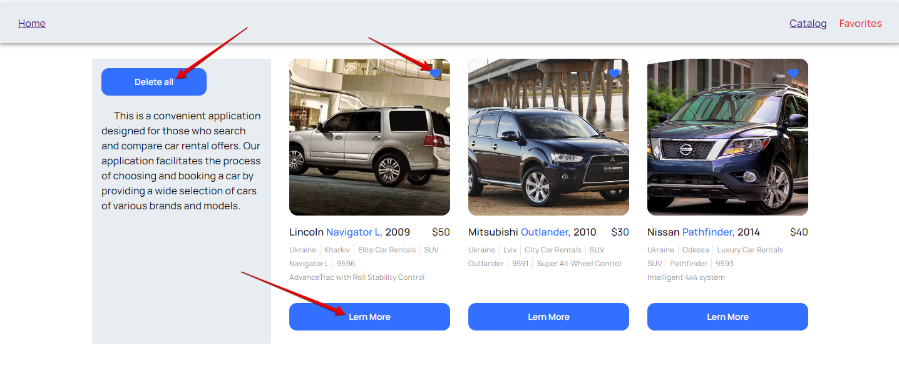

# Easy RentalCAR

 

&emsp;Easy RentalCAR - this is a convenient application designed for those who search
and compare car rental offers. Our application facilitates the process of
choosing and booking a car by providing a wide selection of cars of various
brands and models.

## Main functionalities and possibilities

&emsp;On the Home page you can see a slider with models of machines offered by our
company. If you immediately like the car, you can click on the heart icon at the
top right of the picture and this model will automatically be added to the
Favorites page.

&emsp;Navigating through the pages of the app: On the main screen at the top, you can
link to the Catalog page or Favorite page, where you can browse available cars
for rent.

&emsp;Search and filtering: RentalCar provides many parameters for searching for cars,
such as brand, rental price, car mileage from and to. You can easily adjust the
filters to find a car that meets your needs.

&emsp;Detailed information: for a more detail description of the selected car, you can
click the Learn more button. A modal window will open with detail information
about the selected model.You can also add a model to the list of favorites by
clicking on the heart at the top or remove it from the list of favorites by
clicking on the heart again.

&emsp;Modal window: you can read detail information about the car and if everything
suits you, click the Rental car button, which will automatically connect you
with the company by phone.

&emsp;View even more adverts you can by clicking the Load more button at the bottom of
the Home page.

&emsp;On Favorite page you can view the selected car and see detail information about
the car by clicking the Learn more button. You can remove car from the list of
favorites by clicking on the heart at the top right. You can delete all cars
from the list by clicking the Delete all button in the sidebar.

## Link to the app

&emsp;To use the application, please follow the link
[Car-react](https://svetapan.github.io/car-react/).

<b>Thank you very much for choosing our application!</b>
  

<b>Technologies and tools used in development:</b>
  

 

 

